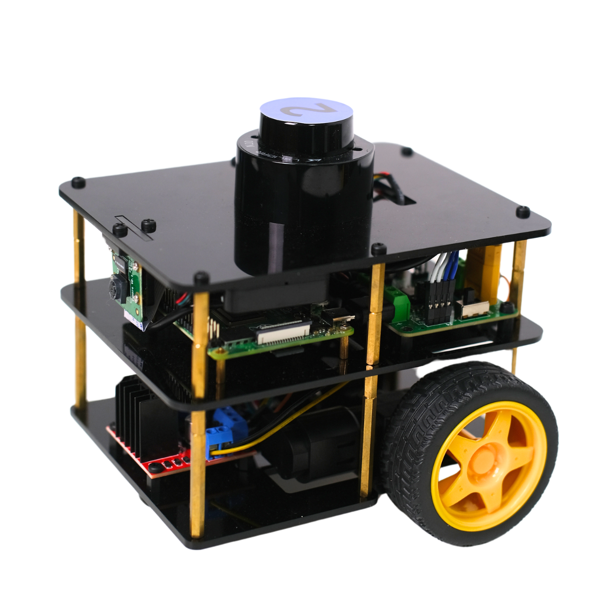

# FastBot ROS2 Bringup

ROS2 packages for controlling the FastBot mobile robot.



The code has been tested on a real FastBot robot with the following setup:

- Ubuntu Server 22.04
- ROS2 Humble
- Raspberry Pi 4
- Arduino Nano
- Raspberry Pi Camera
- LSLiDAR N10

## Prerequisites

Before using this repository, ensure the FastBot robot has been assembled and configured. Each step can be done with the reference link.

1. [Assemble the FastBot Robot](https://www.youtube.com/playlist?list=PLK0b4e05LnzZFFnkMvb3O8zilh0J8VckB)

2. [Install Ubuntu Server on the Raspberry Pi](https://bitbucket.org/theconstructcore/fastbot/src/docker/docs/install_ubuntu_server.md)

3. [Upload the Arduino Firmware](https://bitbucket.org/theconstructcore/fastbot/src/docker/docs/upload_microcontroller_firmware.md)

4. [Set udev rules](https://roboticsknowledgebase.com/wiki/tools/udev-rules/)

5. [Configure the Raspberry Pi Camera](https://bitbucket.org/theconstructcore/fastbot/src/docker/docs/raspicam_v4l2.md)

## Repository

Clone the repo to your ROS2 workspace:

```bash
cd ~/ros2_ws/src

git clone https://github.com/Akitsuyoshi/fastbot.git
```

## Dependencies

If `rosdep` has not been initialized yet:

```bash
sudo rosdep init

rosdep update
```


Install ROS2 dependencies:

```bash
cd ~/ros2_ws

sudo apt update

rosdep install --from-paths src --ignore-src -r -y
```

Install additional system dependecies, ROS2 camera driver:

```bash
sudo apt install ros-humble-v4l2-camera ros-humble-image-transport-plugins v4l-utils
```

## Verify Hardware Configuration

Check udev rules for arduino and lidar:

```bash
ls -l /dev | grep -E 'arduino|lslidar'
```

Expected result:

```text
lrwxrwxrwx 1 root root           7 Mar 24 21:52 arduino -> ttyUSB0
lrwxrwxrwx 1 root root           7 Mar 24 21:52 lslidar -> ttyACM0
```

If not, please refer this [link](https://roboticsknowledgebase.com/wiki/tools/udev-rules/) and reload rules by the following command:

```bash
sudo udevadm control --reload-rules

sudo udevadm trigger
```

Check camera driver:

```bash
v4l2-ctl -D
```

Expected result:

```text
Driver Info:
    Driver name      : bm2835 mmal
    Card type        : mmal service 16.1
    Bus info         : platform:bcm2835-v4l2-0
    Driver version   : 5.15.173
    Capabilities     : 0x85200005
...
```

If not, please check the installation of ROS2 camera driver and configure it by following the [document](https://bitbucket.org/theconstructcore/fastbot/src/docker/docs/raspicam_v4l2.md).

## Build and Run FastBot

To build workspace:

```bash
cd ~/ros2_ws

source /opt/ros/humble/setup.bash

colcon build

source install/setup.bash
```

Launch all robot drivers:

```bash
ros2 launch fastbot_bringup bringup.launch.xml
```

## Test

Check active ROS2 nodes:

```bash
ros2 node list
```

Expected nodes:

```text
/fastbot/serial_motor_driver
/fastbot_camera/v4l2_camera_node
/fastbot_robot_state_publisher
/lslidar_driver_node
```

Check ROS2 topics:

```bash
ros2 topic list
```

Expected result:

```text
/fastbot/cmd_vel
/fastbot/encoder_vals
/fastbot/joint_states
/fastbot/motor_vels
/fastbot/odom
/fastbot/scan
/fastbot_camera/camera_info
/fastbot_camera/image_raw
/tf
/tf_static
...
```

Check published data:
```bash
ros2 topic echo /fastbot/scan --once

ros2 topic echo /fastbot_camera/image_raw --once
```

Move the robot via teleop:
```bash
ros2 run teleop_twist_keyboard teleop_twist_keyboard --ros-args --remap cmd_vel:=/fastbot/cmd_vel
```

If you have ubuntu desktop environment, visualize the robot on rviz2:
```bash
cd ros2_ws/

rviz2 -d src/fastbot/fastbot_bringup/rviz/config.rviz 
```

## Acknowledgements

This project was developed based on the FastBot ROS2 course provided by The Construct.

References:
- https://www.theconstruct.ai/
- https://www.theconstruct.ai/fastbot/
- https://bitbucket.org/theconstructcore/fastbot/
